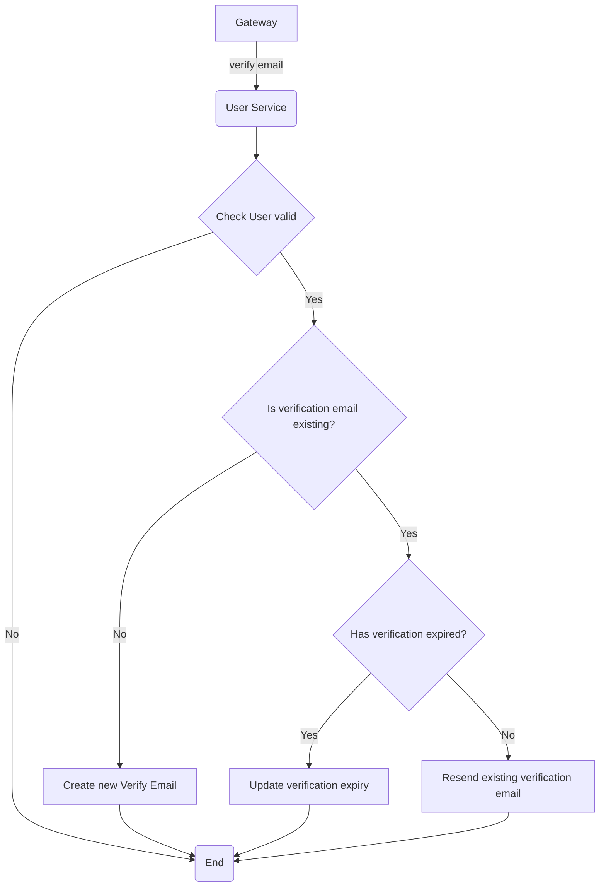
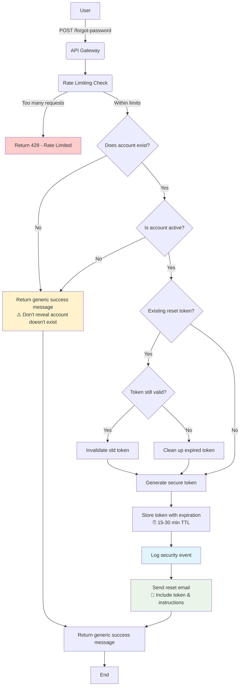

## Verify email flow

```mermaid
flowchart TD
    A[Gateway] -->|verify email| B(User Service)
    B --> C{Check User valid}
    C -->|No| End(End)
    C -->|Yes| D{Is verification email existing?}
    D -->|No| F[Create new Verify Email]
    F --> End

    D -->|Yes| E{Has verification expired?}
    E -->|No| G[Resend existing verification email]
    E -->|Yes| H[Update verification expiry]
    H --> End
    G --> End
```

## Forgot password flow

```mermaid
flowchart TD
    A[User] -->|POST /forgot-password| B(API Gateway)
    B --> C(Rate Limiting Check)
    C -->|Too many requests| D[Return 429 - Rate Limited]
    C -->|Within limits| E{Does account exist?}

    E -->|No| F[Return generic success message<br/>⚠️ Don't reveal account doesn't exist]
    E -->|Yes| G{Is account active?}

    G -->|No| F
    G -->|Yes| H{Existing reset token?}

    H -->|Yes| I{Token still valid?}
    I -->|Yes| J[Invalidate old token]
    I -->|No| K[Clean up expired token]

    H -->|No| L[Generate secure token]
    J --> L
    K --> L

    L --> M[Store token with expiration<br/>⏰ 15-30 min TTL]
    M --> N[Log security event]
    N --> O[Send reset email<br/>📧 Include token & instructions]

    O --> P[Return generic success message]
    F --> P
    P --> Q[End]

    style D fill:#ffcccc
    style F fill:#fff2cc
    style N fill:#e1f5fe
    style O fill:#e8f5e8
```
