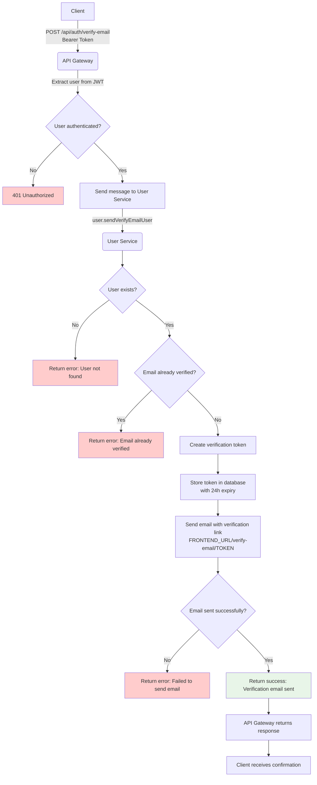

## Email Verification Flow (Current Implementation)

### Send Verification Email



### Verify Email with Token

```mermaid
flowchart TD
    A[User clicks email link] -->|Frontend receives token| B[Frontend]
    B -->|POST /api/auth/verify-email-token<br/>{"token": "..."}| C(API Gateway)
    
    C -->|user.validateEmailVerificationToken| D(User Service)
    D --> E{Token exists in database?}
    E -->|No| F[Return error: Invalid token]
    E -->|Yes| G{Token expired?}
    G -->|Yes| H[Return error: Token expired]
    G -->|No| I{Token already used?}
    I -->|Yes| J[Return error: Token already used]
    I -->|No| K[Mark user email as verified]
    
    K --> L[Mark token as used]
    L --> M[Return success: Email verified]
    M --> N[API Gateway returns success]
    N --> O[Frontend shows success message]
    
    style F fill:#ffcccc
    style H fill:#ffcccc
    style J fill:#ffcccc
    style M fill:#e8f5e8
```

## Password Reset Flow (Current Implementation)

### Request Password Reset

```mermaid
flowchart TD
    A[User] -->|POST /api/auth/forgot-password<br/>{"email": "user@example.com"}| B(API Gateway)
    B -->|user.forgotPassword| C(User Service)
    
    C --> D{User exists and active?}
    D -->|No| E[Log attempt but don't reveal]
    D -->|Yes| F[Create password reset token]
    
    F --> G[Store token in database<br/>with 30min expiry]
    G --> H[Send email with reset link<br/>FRONTEND_URL/reset-password/TOKEN]
    H --> I{Email sent successfully?}
    I -->|No| J[Log error silently]
    I -->|Yes| K[Log security event]
    
    E --> L[Return generic success message<br/>⚠️ Don't reveal if account exists]
    J --> L
    K --> L
    L --> M[API Gateway returns success]
    M --> N[Client receives confirmation]

    style E fill:#fff2cc
    style J fill:#ffcccc
    style K fill:#e8f5e8
    style L fill:#e8f5e8
```

### Validate Reset Token and Reset Password

```mermaid
flowchart TD
    A[User clicks reset link] --> B[Frontend extracts token from URL]

    subgraph "Step 1: Validate Token"
        B -->|GET /api/auth/validate-forgot-password-token?token=xyz| C(API Gateway)
        C -->|user.validateForgotPasswordToken| D(User Service)
        D --> E{Token exists in database?}
        E -->|No| F[400: Invalid token]
        E -->|Yes| G{Token expired?}
        G -->|Yes| H[400: Token expired]
        G -->|No| I[200: Token valid]
    end

    F --> J[Frontend shows error]
    H --> J
    I --> K[Frontend shows password form]

    subgraph "Step 2: Reset Password"
        K --> L[User enters new password]
        L -->|POST /api/auth/reset-password<br/>{"token": "...", "newPassword": "..."}| M(API Gateway)
        M -->|user.reset-password| N(User Service)
        N --> O{Password validation}
        O -->|Fail| P[400: Validation errors]
        O -->|Pass| Q{Token still valid & unused?}
        Q -->|No| R[400: Token invalid/expired/used]
        Q -->|Yes| S[Hash new password]
        S --> T[Update user password]
        T --> U[Mark token as used]
        U --> V[Log security event]
        V --> W[200: Password reset success]
    end

    P --> K
    R --> X[Frontend shows error]
    W --> Y[Frontend redirects to login]
    J --> Z[End]
    X --> Z
    Y --> Z

    style F fill:#ffcccc
    style H fill:#ffcccc
    style P fill:#ffcccc
    style R fill:#ffcccc
    style I fill:#e8f5e8
    style W fill:#e8f5e8
```

## Authentication Flow (Current Implementation)

### User Registration and Login

```mermaid
flowchart TD
    subgraph "Registration Flow"
        A[User] -->|POST /api/auth/register<br/>email, password, name| B(API Gateway)
        B -->|user.findUserByEmail| C(User Service)
        C --> D{User exists?}
        D -->|Yes| E[409: User already exists]
        D -->|No| F[Hash password]
        F -->|user.create| G[Create user in database]
        G -->|auth.generateToken| H(Auth Service)
        H --> I[Generate JWT token]
        I --> J[Return token + user data]
    end

    subgraph "Login Flow"
        K[User] -->|POST /api/auth/login<br/>email, password| L(API Gateway)
        L -->|user.findUserByEmailAndPassword| M(User Service)
        M --> N[Verify password hash]
        N --> O{Credentials valid?}
        O -->|No| P[400: Invalid credentials]
        O -->|Yes| Q[Update last login time]
        Q -->|auth.generateToken| R(Auth Service)
        R --> S[Generate JWT token]
        S --> T[Return token + user data]
    end

    style E fill:#ffcccc
    style P fill:#ffcccc
    style J fill:#e8f5e8
    style T fill:#e8f5e8
```


