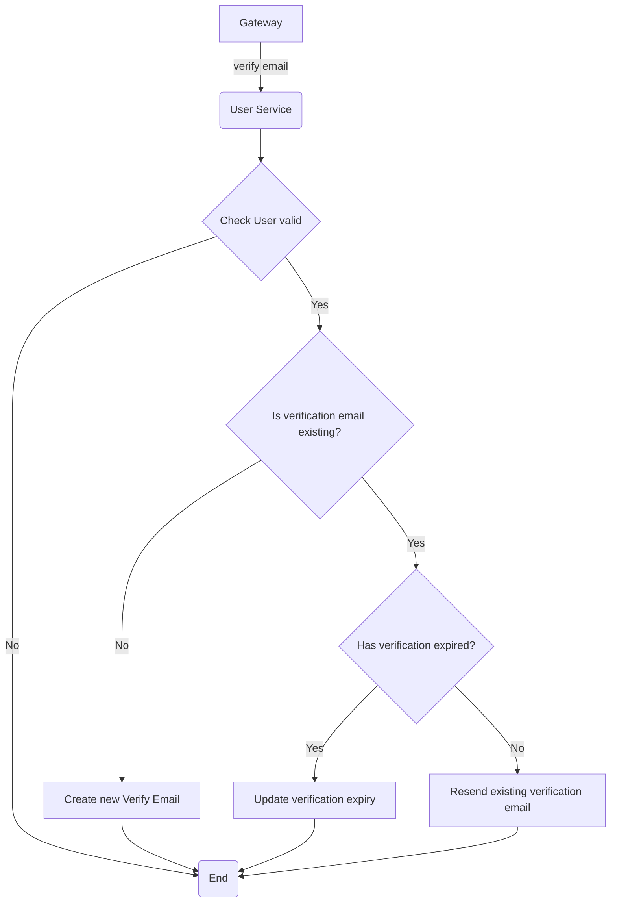

```mermaid
flowchart TD
    A[Gateway] -->|verify email| B(User Service)
    B --> C{Check User valid}
    C -->|No| End(End)
    C -->|Yes| D{Is verification email existing?}
    D -->|No| F[Create new Verify Email]
    F --> End

    D -->|Yes| E{Has verification expired?}
    E -->|No| G[Resend existing verification email]
    E -->|Yes| H[Update verification expiry]
    H --> End
    G --> End
```
